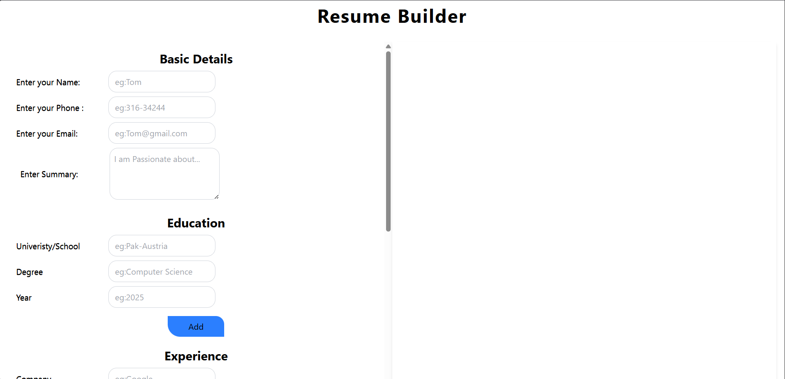
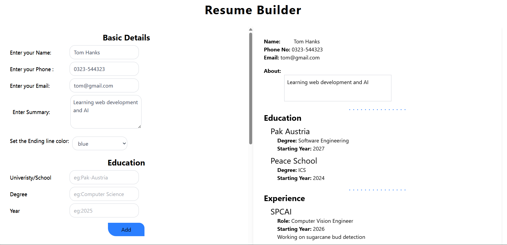

# 📄 Resume Builder – React + Vite

A Simple **Resume Builder web application** built using **React**, **Vite**, and **Tailwind CSS**.  
Users can create a professional resume with live preview and download it as a **PDF**.

---

## 🌐 Live Demo

👉 **View Live Application:**  
https://resume-builder-murex-theta.vercel.app/

---

## 📸 Application Preview






## 🚀 Features

- ✏️ Add Basic Details (Name, Phone, Email, Summary)
- 🎓 Add multiple Education entries
- 💼 Add multiple Experience entries
- 📌 Add Projects with descriptions
- 🛠️ Add Skills dynamically
- 🎨 Select custom separator line color
- 👀 Live resume preview
- 📄 Download resume as PDF
- 🔔 Toast notifications on successful actions

---

## 🛠️ Tech Stack

- **React.js**
- **Vite**
- **Tailwind CSS**
- **React Hooks**
- **react-to-print**
- **react-toastify**

---

### 1️⃣ Clone the repository
```bash
git clone https://https:github.com/abdullah-waqar/resume_builder
```
### 2️⃣ Clone the repository
```bash
cd resume-builder
```

### 3️⃣ Install dependencies
```bash
npm install
```

###4️⃣ Run the development server
```bash
npm run dev
```

### OPEN YOUR BROWSER AT
```bash
http://localhost:5173
```
